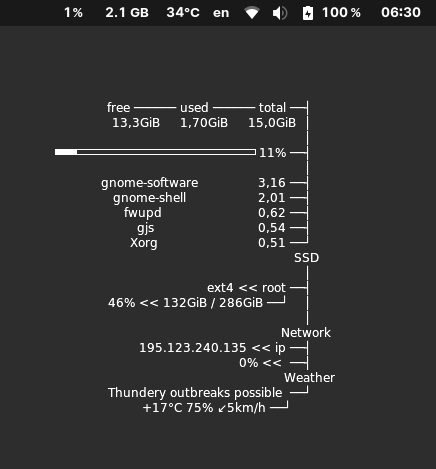

# conkyrc

This repository contains my personal Conky configuration file (`conkyrc`) along with any associated assets or scripts. Conky is a lightweight system monitor for Linux and Unix-like systems that provides customizable desktop widgets.



## Getting Started

To use my Conky configuration, follow these commands:

```
sudo apt install conky
cd /tmp
git clone https://github.com/s31frc3/conkyrc/conkyrc
rm ~/.conkyrc
mv /tmp/conkyrc/conkyrc ~/.conkyrc
```
**Run Conky:** Start Conky by executing the following command in your terminal:
```
conky
```

## Contributing

If you'd like to contribute to this project, you can do so by following these steps:

1. Fork the repository.

2. Create a new branch for your feature or bug fix.

3. Make the necessary changes and commit them.

4. Push your changes to your forked repository.

5. Submit a pull request, explaining your changes and why they should be merged.
